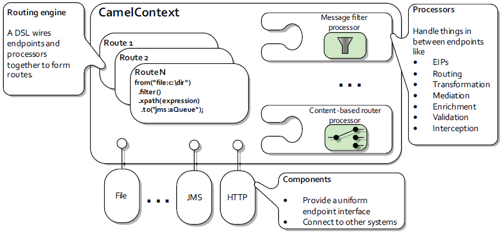
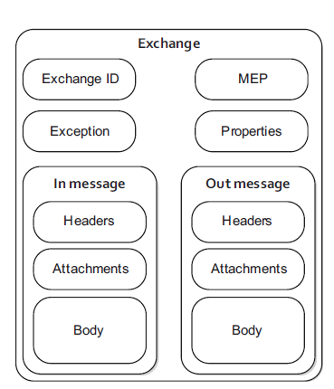

# Apache Camel

### Camel Architecture: 

### Message: 
The fundamental entity containing the data being carried and routed in Camel.

### Exchange: 
An Exchange is the message container holding the information during the entire routing of a Message received by a Consumer.

* **Exchange ID** — A unique ID that identifies the exchange. Camel automatically generates the unique ID.
* **MEP** — A pattern that denotes whether you’re using the InOnly or InOut messaging style. When the pattern is InOnly , the exchange contains an in message. For InOut , an out message also exists that contains the reply message for the caller. 
* **Exception** — If an error occurs at any time during routing, an exception will be set in the exception field.
* **Properties** — Similar to message headers, but they last for the duration of the entire exchange. Properties are used to contain global-level information, whereas message headers are specific to a particular message. Camel itself adds various properties to the exchange during routing. You, as a developer, can store and retrieve properties at any point during the lifetime of an exchange.
* **In message** — This is the input message, which is mandatory. The in message contains the request message.
* **Out message** — This is an optional message that exists only if the MEP is InOut. The out message contains the reply message.# camel

#### Examples:

* [File copy](./file-copy/README.md)
* [Content based routing](./content-based-routing/README.md)
* [Message-filter](./message-filter/README.md)
* [Message-multicasting](./message-multicasting/README.md)
